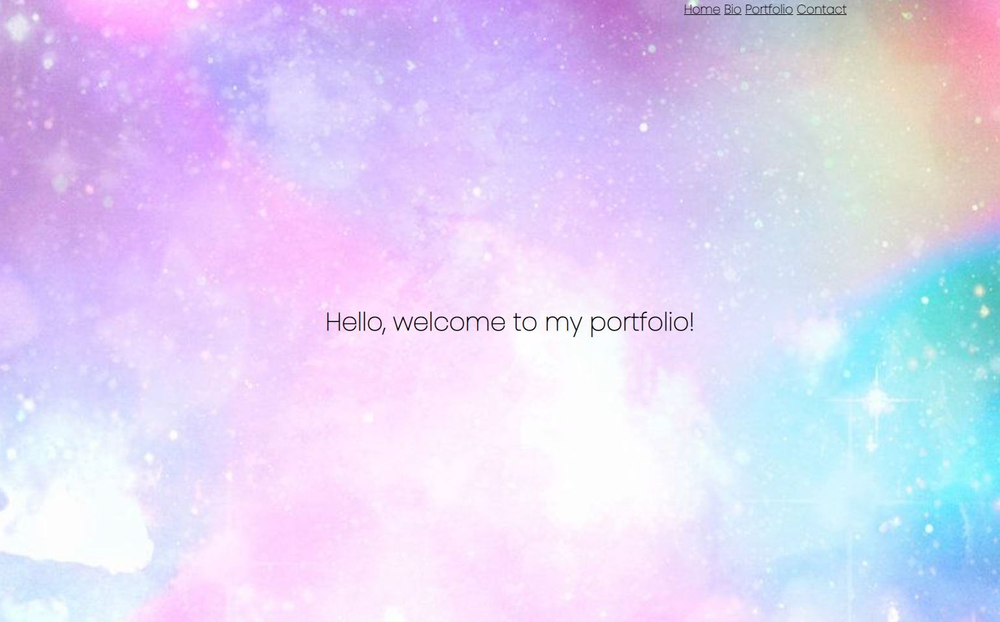
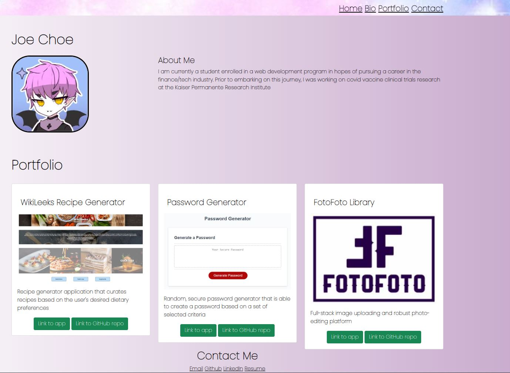

# Professional Materials

## Objectives

Providing an updated portfolio page in order to build toward being employer-competitive.

## Requirements
* Updated portfolio featuring Project 1 and two exemplary homework assignments.
* Updated GitHub profile with pinned repositories featuring Project 1 and two exemplary assignments.
* Updated resume
* Updated LinkedIn profile

## Instructions

1. [Updated Portfolio](#updated-portfolio)

2. [Updated GitHub Profile](#updated-github-profile)

3. [Updated Resume](#updated-resume)

4. [Updated LinkedIn](#updated-linkedin)

## Updated Portfolio

My updated portfolio should:

1. Display contact info, including email or phone number

2. Have links to my GitHub profile and LinkedIn profile

3. Have a link to a downloadable PDF of my resume

4. Display at least 2 examples of student work from either deployed projects or homeworks. Each project should include the following:

	* Project title

	* Link to the deployed version

	* Link to the GitHub repository

	* Screenshot of the deployed application

5. Have a polished, mobile-responsive user interface.

6. Design
   * Mobile-first design
   * Choosing a color palette for your site so it doesn't just look like the default bootstrap theme or an unstyled HTML site.
   * Making sure the font size is large enough to read, and that the colors don't cause eye strain.

## Updated GitHub Profile 

The GitHub profile must contain at least the following items:

1. Profile picture or avatar

  * A photo or an avatar other than the default Github identicon. (a semi-professional to professional photo or an avatar photo are preferred)

2. Biography

3. Email address. If you don't want to share your personal email or phone number, use a developer email.

4. Link to deployed portfolio

5. At least 2 pinned repositories

6. Following a few of my classmates and/or other developers. They are the beginning of your professional network and being a developer is as much about being a part of the community as it is writing code.

7. README files. Every pinned project should contain a README file with:

	* Title of app

	* Live link to deployed app

	* List of technologies used

	* 1-2 sentences explaining what the app is

	* 2-3 Screenshots / gifs of the app

	* License (usually MIT)
	
	* Contact information for you and any collaborators

8. Commit history. Every pinned repository should have at least 20 commits.

## Updated Resume 

Resume should include:

* a heading with my name, phone number, professional email address, links to LinkedIn, portfolio and GitHub

* a technical skills section, with all programming languages and technologies listed

* 3 projects/homework assignments with brief description, languages used, and URLs

## Updated LinkedIn

LinkedIn profile should contain a strong bio statement, a professional photo, and links to my Github and portfolio.

**Technologies Used**
* HTML, CSS, JavaScript, Bootstrap
  
* **Screenshots**

**Submission**
* The URL of the deployed application.
  * URL of deployed application: https://jchoe125.github.io/Professional-Materials/
* The URL of the GitHub repository, with a unique name and a README that describes the project
  * URL to GitHub repository: https://github.com/jchoe125/Professional-Materials

**Contact Me**
* Email: joechoe125@gmail.com
* Github: https://github.com/jchoe125
* LinkedIn: https://www.linkedin.com/in/joe-choe-a97b52237/

**License**
* [License](https://github.com/jchoe125/Professional-Materials/blob/main/licenseMITtxt)

